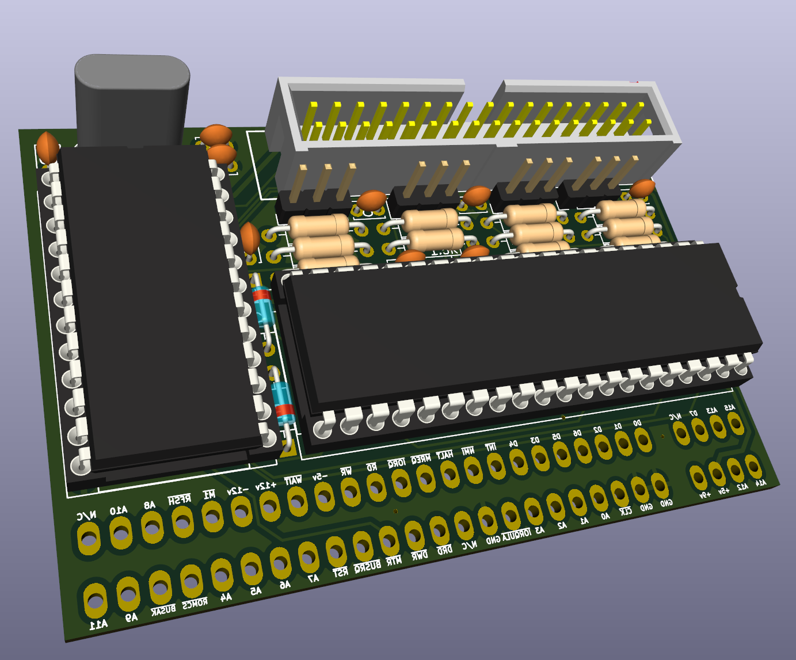
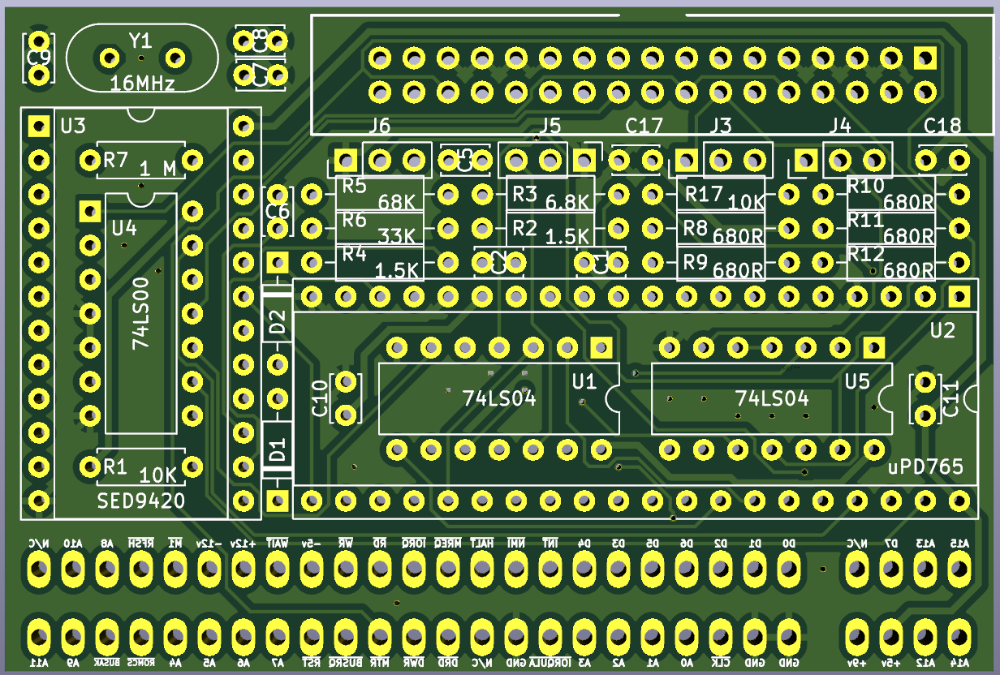
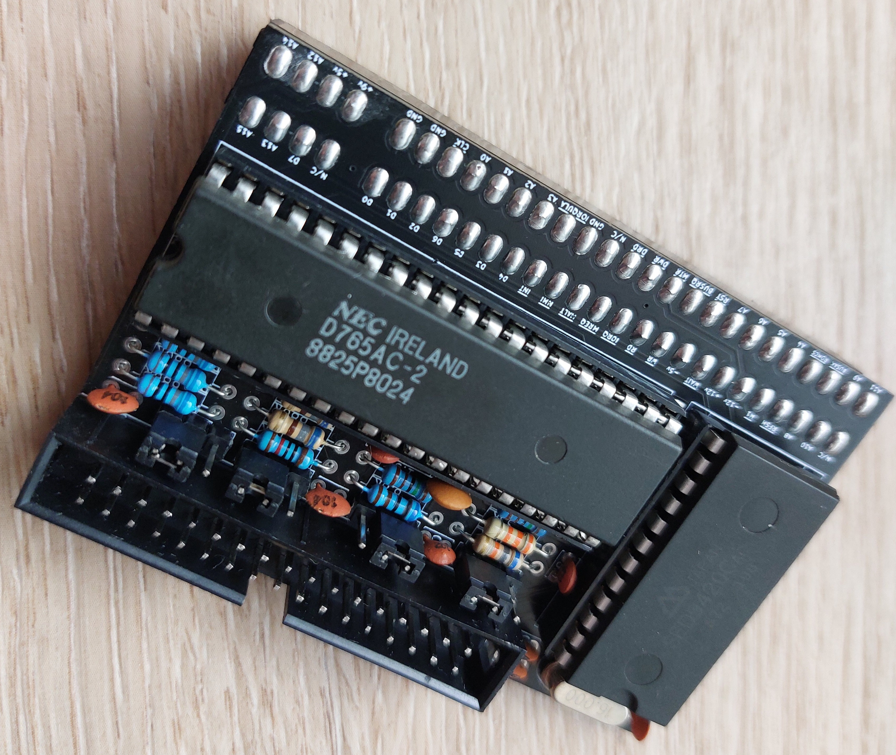
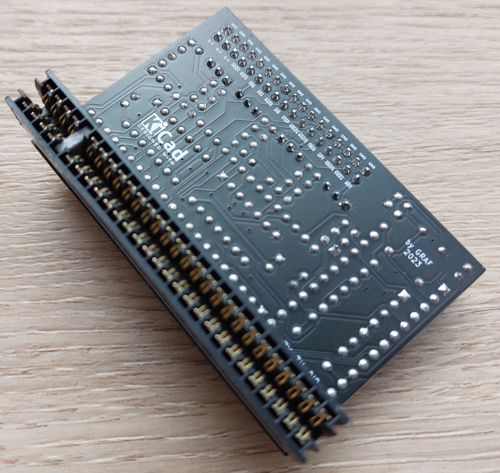
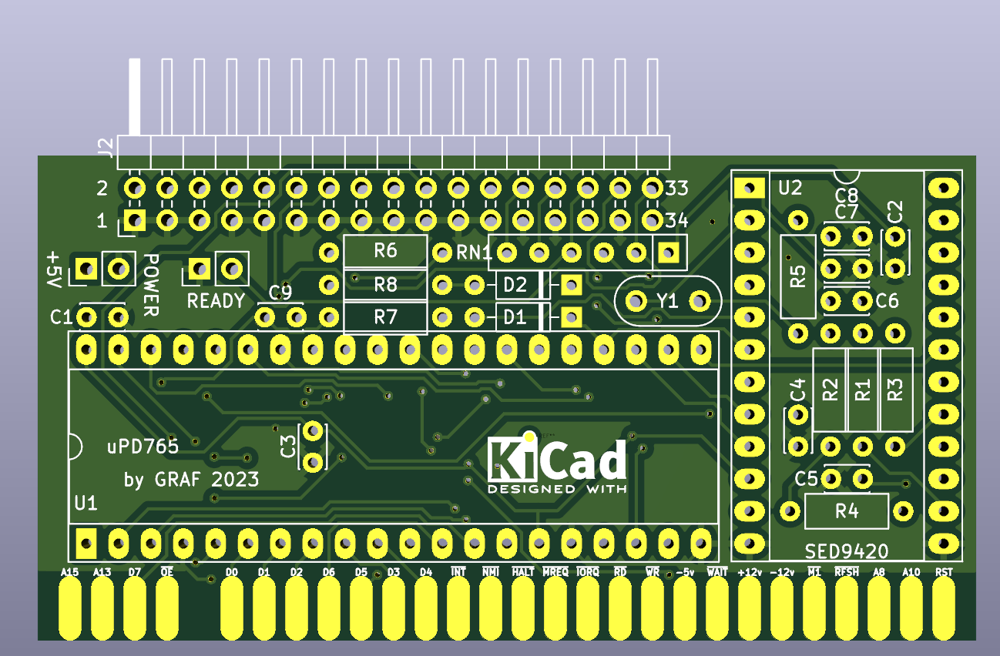
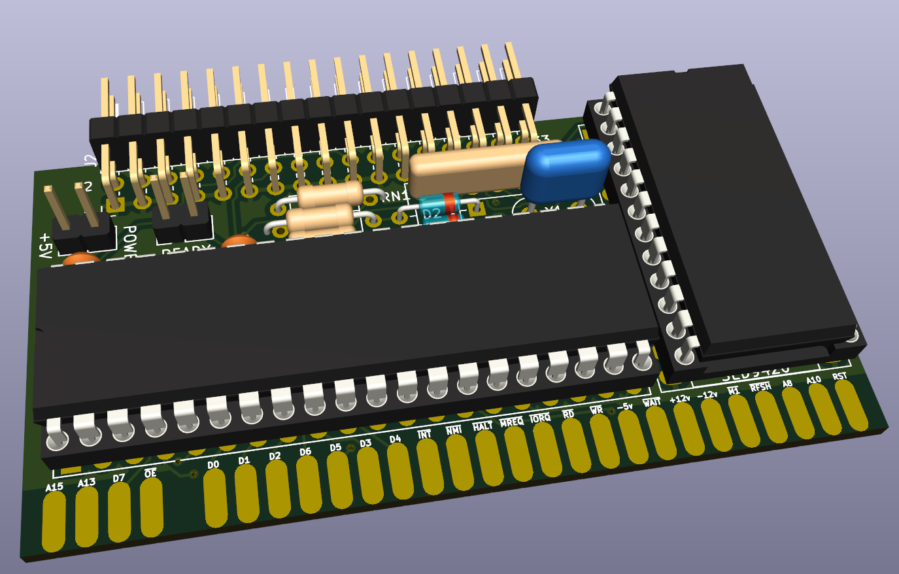
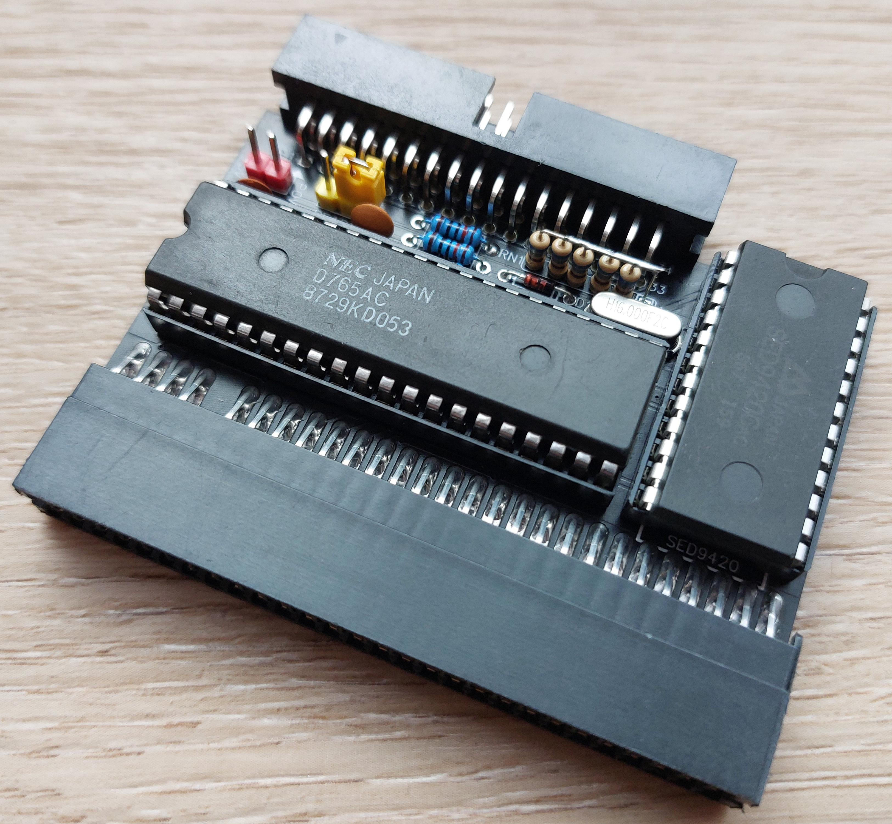
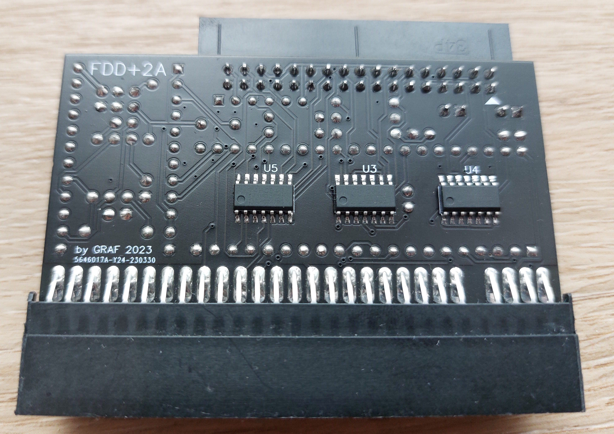

# 💾 ZX-Spectrum-plus2A-fdd-interface-light

Hardware interface to connect standard 3.5" floppy disk drives (or Gotek emulators) to the ZX Spectrum +2A/2B using the native +3DOS.  
  
Открытый проект (Open-Source) аппаратного интерфейса дисковода гибких дисков (FDD) для компьютеров **ZX Spectrum +2A и +2B** (модели в черном корпусе).  
  
Проект построен на базе классической микросхемы контроллера **μPD765A** (или Intel 8272A) — точно такого же чипа, который использовался в оригинальном ZX Spectrum +3.  
  
Благодаря полному аппаратному копированию архитектуры +3, данный интерфейс обеспечивает **100% нативную совместимость со встроенной операционной системой +3DOS**.

Вам не понадобятся кастомные прошивки ПЗУ, сложные патчи или программные эмуляторы. Достаточно подключить интерфейс к системной шине (Expansion Bus), подсоединить дисковод и сразу использовать штатные команды +3 BASIC для работы с диском (`LOAD "a:"`, `FORMAT` и т.д.).

### Почему этот проект актуален?
Модели Sinclair ZX Spectrum +2A/+2B поставлялись со встроенным кассетным магнитофоном, но получили обновленную материнскую плату и ПЗУ от «дискового» флагмана +3.  
Этот интерфейс устраняет несправедливость и позволяет легко проапгрейдить ваш +2A, подключив к нему как **реальный механический дисковод 3.5"**, так и современный эмулятор **Gotek** с прошивкой FlashFloppy.

## 🎛️ Версии печатных плат (PCB)

Проект разработан в двух вариантах исполнения, что позволяет выбрать наиболее удобный способ сборки:

1. **DIP-версия (Классическая)**  
   * Все вспомогательные микросхемы (логика, буферы) выполнены в выводных корпусах DIP.
   * Идеально подходит для начинающих радиолюбителей и легкой сборки в домашних условиях.
   * Содержит расширенный набор конфигурационных перемычек (джамперов) для гибкой настройки под любые дисководы.
  
[Схема](Export/FDD-3H-DIP.pdf) [Монтаж](Export/FDD-3H-DIP.html) [Gerber](Gerber/FDD-3H-DIP_GERBER.zip)
  
  

  

  

  
  
  
2. **SOP-версия (Компактная)**  
   * Вспомогательная логика переведена на SMD-компоненты (корпуса SOP/SOIC).
   * Более компактный и современный вид платы, требующий базовых навыков SMD-пайки.
   
[Схема](Export/FDD-3H-SOP.pdf) [Монтаж](Export/FDD-3H-SOP.html) [Gerber](Gerber/FDD-3H-SOP_GERBER.zip)
  
  

  

  

  
  
  
---
  
## 🔌 Конфигурация перемычек (Джамперов) — только для DIP-версии

На DIP-версии платы предусмотрены аппаратные перемычки, которые позволяют адаптировать интерфейс без физической доработки и порчи корпуса самого дисковода:

* **Выбор сигнала READY**: Позволяет нативно переключать логику работы 34-го контакта шлейфа. Вы можете жестко задать сигнал готовности, если используете стандартный ПК-дисковод без встроенной поддержки Shugart-стандарта. (Актуально и для SOP версии)
* **Перемена мест дисководов (Swap A/B)**: Аппаратная смена очередности приводов. Вы можете назначить любой физический дисковод (или эмулятор Gotek) логическим диском `A:` или `B:` без перепайки резисторов на плате самого дисковода.
* **Блокировка выбора стороны (Side Select Lock)**: Позволяет заблокировать выбор стороны диска. Полезно для специфических тестов, работы со старыми односторонними дискетами или при отладке некоторых образов программ.

# Доработка некоторых моделей Floppy

  ## 🔧 Модификация дисководов 3.5" (Адаптация под стандарт Shugart / READY)

Стандартные дисководы от обычных ПК (Sony, Samsung, Mitsumi, Panasonic) настроены под требования IBM PC [1]. Для корректной работы с контроллером μPD765 на ZX Spectrum требуются два условия:
1. **Выбор дисковода как Drive A:** (система ожидает устройство на логическом адресе DS0, тогда как в ПК все приводы жестко настроены на DS1) [1].
2. **Сигнал READY на 34-м контакте:** (дисководы ПК выдают на этот контакт сигнал смены диска `Disk Change`, а Спектруму нужен сигнал готовности `READY`) [1].

---

### 🔥 Важно: если у вас DIP-версия платы интерфейса
Благодаря встроенным на плату перемычкам, вам **не нужно** резать дорожки и паять провода внутри дисковода для получения сигнала READY или смены адреса A/B [1]. Просто настройте соответствующие джамперы на плате интерфейса под ваш ПК-дисковод.

---

### 🛠️ Инструкция для SOP-версии (модификация самого дисковода)

Если вы используете компактную SOP-версию платы, модификацию нужно провести на плате самого 3.5" дисковода [1]. Ниже приведены инструкции для самых популярных моделей:

#### 1. Sony MPF920 (Самый распространенный)
* **Смена адреса (DS0):** Найдите на плате дисковода контактные площадки `JC30` / `JC31` (или `DS0` / `DS1`) рядом с интерфейсным разъемом [1]. Аккуратно перепаяйте SMD-резистор (или каплю припоя) с позиции `DS1` на позицию `DS0` [1].
* **Сигнал READY:** 
  1. Найдите дорожку, идущую к **34-му контакту** разъема шлейфа [1]. Аккуратно перережьте её скальпелем, чтобы отключить штатный сигнал `Disk Change` [1].
  2. Найдите **5-й вывод** главной микросхемы контроллера дисковода (или точку с маркировкой `RDY`) [1].
  3. Припаяйте тонкий монтажный провод от точки `RDY` напрямую к **34-му контакту** разъема шлейфа [1].

#### 2. Samsung SFD-321B
* **Смена адреса (DS0):** Найдите контактные площадки с маркировкой `DC0` / `DC1` (или `S0` / `S1`). Переставьте каплю припоя/резистор из положения `1` в положение `0` [1].
* **Сигнал READY:** На плате рядом с 34-контактным разъемом есть готовые площадки, подписанные как `DC` (Disk Change) и `RDY` (Ready) [1]. По умолчанию они замкнуты в режиме ПК. Просто уберите припой с перемычки `DC` и замкните им площадки `RDY` [1]. Резать дорожки на этой модели не требуется.

---

### ⚙️ Альтернатива: Настройка эмулятора Gotek
Если вместо механического дисковода вы подключаете популярный эмулятор **Gotek**, паять ничего не придется вообще [1]. Прошейте его альтернативной прошивкой [FlashFloppy](https://github.com) и добавьте в файл конфигурации `FF.CFG` на вашей USB-флешке следующие строки:

```ini
interface = shugart
host = dec-shugart
pin34 = rdy
```


